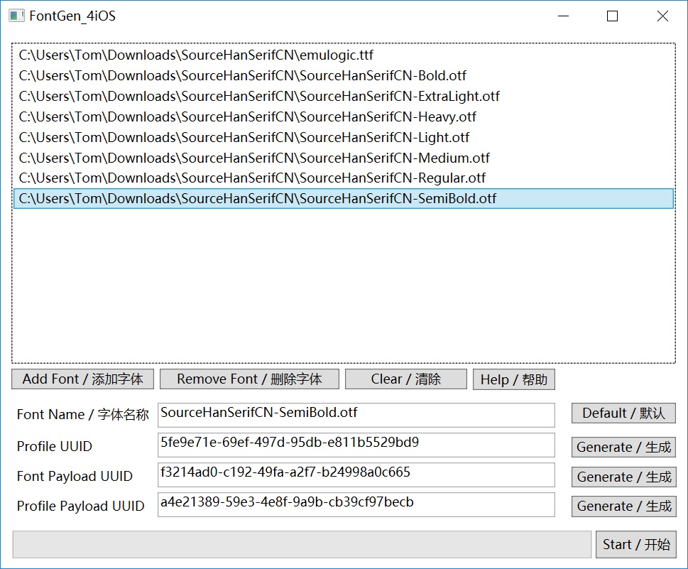
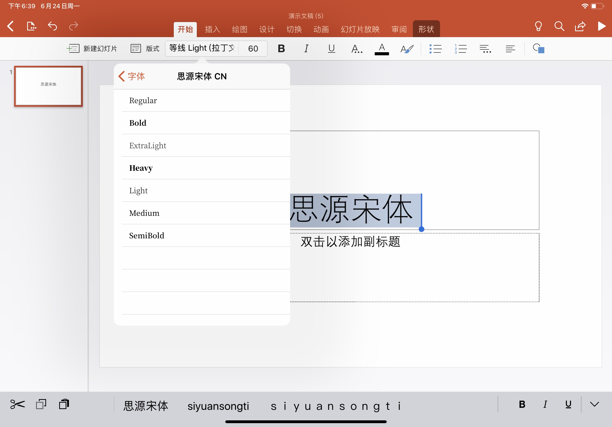
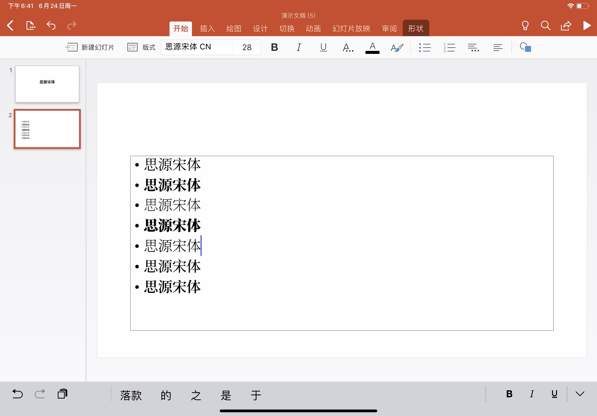
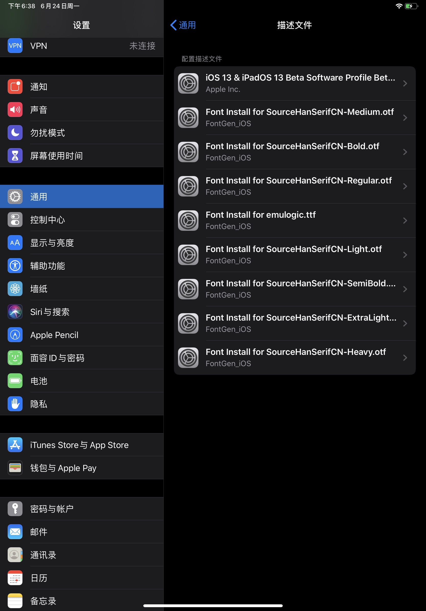

# FontGen_4iOS Windows

[English](readme.md) [简体中文](readme-cn.md)

## 这是干啥的

用来给 iOS 安装自定义字体的。以前需要 Mac 版的 Apple Configurator 2 才能生成相应的配置文件，现在用这个小工具，Windows 上也能自己生成带字体的 .mobileconfig，然后安装到 iOS 设备上了。自己安装的字体可以在 Microsoft Office 和 Apple iWork 等各类生产力软件中使用。

## 这个小 App 对电脑的需求

安装了 [.Net Framework 4.5](https://www.microsoft.com/zh-cn/download/details.aspx?id=30653) 的 Windows 7 或更高版本的操作系统。

## 使用方法

1. 导入 .otf/.ttf 字体。 支持从资源管理器中拖拽。

2. 点击 “Start/开始”，选择输出文件夹即可。

3. 通过某些手段把生成的 .mobileconfig 文件传输到 iOS 设备上。

## 注意事项

- iOS 只支持 .otf 和 .ttf 字体文件。

- 生成的 .mobileconfig 文件如果超过 20MB 的话， iOS 设备会无法识别，请注意使用的字体大小。

- 一次只能往系统设置里导入一个 .mobileconfig 文件，如果在安装前导入另一个描述文件的话，上一个导入但未安装的描述文件将会被覆盖。也就是说描述文件要一个一个的安装（也就是说，你必须一个一个地安装所有的描述文件，使用 AirDrop 传输的时候尤其要注意）。

## Tips：往 iOS 设备导入描述文件的几个方法

- 把文件上传到 iCloud Drive 上，用自带的“文件”App下载。

- 给自己的邮箱将描述文件以附件的形式发送邮件。使用 iOS 自带的“邮件”App下载附件。

- 将文件上传到 Http(s) 服务器上（或者支持直接下载的网盘），使用 Safari 下载上传的描述文件。

- 使用其他苹果设备的 AirDrop 功能传输，注意一次只能传输一个描述文件。

- 可能还有其他的办法，待补充。

## 会有 Mac 版吗？

- [终于完成了，点击这里查看](https://github.com/TomJinW/FontGen_4iOS_Mac)

